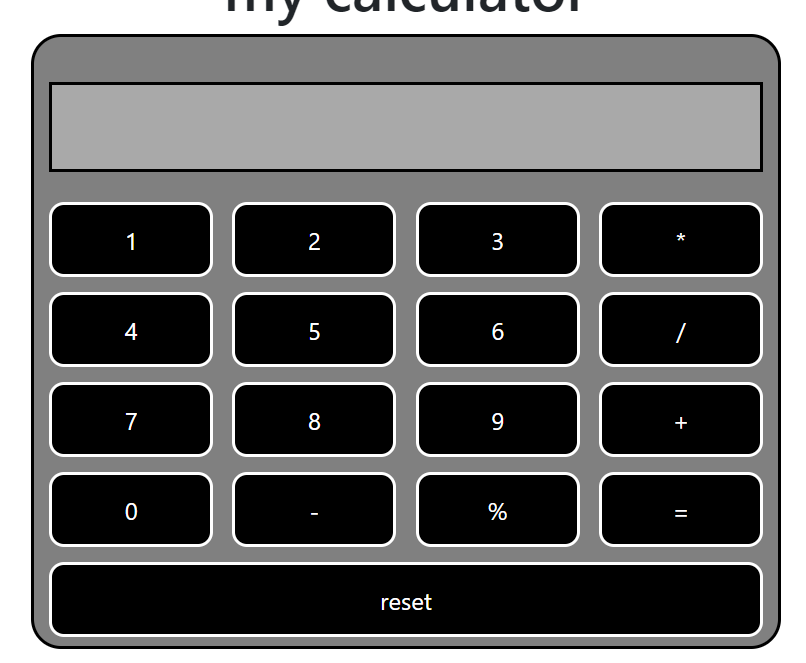

# Simple Calculator

This is a simple calculator application built using JavaScript and CSS. It was one of my early projects when I started learning JavaScript, and it helped me understand the basics of DOM manipulation, event handling, and styling with CSS.

## Technologies Used

- **HTML5**: For structuring the layout.
- **CSS3**: For styling and responsiveness.
- **JavaScript**: For the logic behind the calculator's operations.
## Screenshots




## Installation

To run the calculator locally, follow these steps:

1. **Clone the repository**:

   ```bash
   git clone https://github.com/giftlion/calculator.git
   ```


